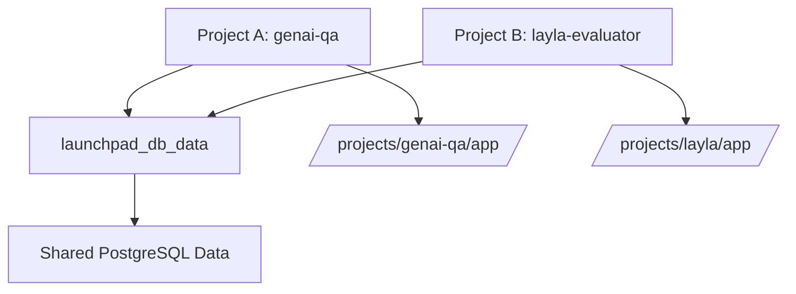

# Multi-Project Management with GenAI Launchpad

## Executive Summary

This document provides a comprehensive analysis of how multiple projects using the GenAI Launchpad template interact with shared Docker infrastructure, database persistence mechanisms, and best practices for managing multiple customer projects without data conflicts or compute re-execution.

## Table of Contents

1. [Investigation Background](#investigation-background)
2. [Architecture Analysis](#architecture-analysis)
3. [Data Persistence Mechanisms](#data-persistence-mechanisms)
4. [Project Isolation Strategies](#project-isolation-strategies)
5. [Best Practices](#best-practices)
6. [Risk Assessment](#risk-assessment)
7. [Recommended Configurations](#recommended-configurations)
8. [Troubleshooting Guide](#troubleshooting-guide)

## Investigation Background

### Problem Statement

Multiple projects using the GenAI Launchpad template with identical Docker configurations (`PROJECT_NAME=launchpad`) exhibited unexpected behavior where:

- Data appeared to persist when switching between projects
- The `events` table appeared empty in one project despite containing data in another
- Concerns about data isolation and accidental data loss during project switches

### Investigation Scope

The investigation examined:

- Docker volume behavior with identical `PROJECT_NAME` values
- Database initialization and migration patterns
- Container lifecycle management across different project directories
- Data persistence mechanisms in Supabase/PostgreSQL setup

## Architecture Analysis

### Docker Compose Structure

The GenAI Launchpad uses a multi-file Docker Compose setup:

```yaml
# docker-compose.yml
include:
  - path: ./docker-compose.launchpad.yml  # Application services
  - path: ./docker-compose.supabase.yml   # Database and infrastructure
```

### Key Components

1. **Application Layer** (`docker-compose.launchpad.yml`)
   - FastAPI application container
   - Celery worker container
   - Redis container

2. **Infrastructure Layer** (`docker-compose.supabase.yml`)
   - PostgreSQL database (Supabase-configured)
   - Authentication services (GoTrue)
   - Storage and analytics components

3. **Configuration Layer**
   - Environment variables from `docker/.env`
   - Volume mounts for application code and database initialization

## Data Persistence Mechanisms

### Volume Naming Convention

Docker volumes are created using the pattern: `${PROJECT_NAME}_${service}_data`

Example with `PROJECT_NAME=launchpad`:

- `launchpad_db_data` - PostgreSQL data directory
- `launchpad_db_config` - PostgreSQL configuration
- `launchpad_redis_data` - Redis persistence

### Volume Sharing Behavior

**Key Finding**: Projects with identical `PROJECT_NAME` values share Docker volumes but maintain application isolation through bind-mounted directories.



### Container Metadata Tracking

Docker Compose tracks project context through container labels:

- `com.docker.compose.project.working_dir`
- `com.docker.compose.project.config_files`

This enables project-specific container management despite shared volumes.

## Project Isolation Strategies

### Strategy 1: PROJECT_NAME Isolation (Recommended)

**Implementation**: Use unique `PROJECT_NAME` values for each customer project.

```bash
# Customer A project
PROJECT_NAME=customer_a_analytics

# Customer B project  
PROJECT_NAME=customer_b_analytics
```

**Benefits**:

- Complete Docker resource isolation
- No shared volumes or networks
- Zero risk of data contamination
- Parallel execution capability

**Drawbacks**:

- Higher resource usage
- Multiple database instances

### Strategy 2: Database Schema Isolation

**Implementation**: Shared infrastructure with database-level separation.

```bash
# Shared PROJECT_NAME
PROJECT_NAME=launchpad

# Different database configurations
DATABASE_NAME=customer_a_db  # vs customer_b_db
POOLER_TENANT_ID=customer_a  # vs customer_b
```

**Benefits**:

- Resource efficiency
- Shared infrastructure maintenance
- Database-level access controls

**Drawbacks**:

- Requires careful configuration management
- Potential for connection string errors

### Strategy 3: Application-Level Isolation (Current State)

**Implementation**: Shared volumes with isolated application bind mounts.

**Characteristics**:

- Same `PROJECT_NAME` across projects
- Shared Docker volumes (`launchpad_db_data`)
- Different application directories mounted to containers
- Different database initialization scripts

**Data Flow**:

1. Projects share the same PostgreSQL data volume
2. Each project mounts its own application code
3. Database schemas may differ based on project-specific migrations
4. Applications access shared database with potentially different table structures

## Migration Configuration Requirements

### Critical Configuration Dependencies

When implementing Complete Isolation (Strategy 1) with unique `PROJECT_NAME` values, specific configuration changes are required to ensure successful database migrations using Alembic.

#### Problem: Database Authentication Failures During Migration

**Symptoms**:

```bash
psycopg2.OperationalError: connection to server at "localhost" (127.0.0.1), port 5432 failed: 
FATAL: password authentication failed for user "postgres.launchpad"
```

**Root Cause**: The Supabase pooler (Supavisor) creates tenant-specific database users based on `POOLER_TENANT_ID`, but mismatched configuration between `docker/.env` and `app/.env` causes authentication failures.

#### Required Configuration Changes

**Step 1:** Update `docker/.env`

```bash
# Change both PROJECT_NAME and POOLER_TENANT_ID to match
PROJECT_NAME=layla_genai_qa_evaluator
POOLER_TENANT_ID=layla_genai_qa_evaluator  # Must match PROJECT_NAME
```

**Step 2:** Update `app/.env`

```bash
# Database user must match the tenant pattern
DATABASE_USER=postgres.layla_genai_qa_evaluator  # postgres.{POOLER_TENANT_ID}
DATABASE_PORT=6543  # Use pooler transaction port, not direct database port (5432)
```

**Step 3:** Restart Docker containers

```bash
cd docker && ./stop.sh && ./start.sh
```

#### Key Technical Details

**Pooler User Creation**: The Supavisor pooler automatically creates database users in the format `postgres.{POOLER_TENANT_ID}` when applications attempt to connect.

**Port Requirements**:

- Port `5432`: Direct database connection (bypasses pooler authentication)
- Port `6543`: Pooler transaction port (handles tenant-based authentication)

**Authentication Flow**:

1. Application connects to `localhost:6543` with user `postgres.{TENANT_ID}`
2. Pooler validates tenant credentials and creates user if needed
3. Pooler forwards connection to PostgreSQL database
4. Alembic migrations execute successfully

#### Migration Execution After Configuration

Once properly configured, standard migration commands work as expected:

```bash
cd app
./makemigration.sh  # Creates migration files
./migrate.sh        # Applies migrations to database
```

#### Python Path Configuration for Migration Scripts

**Problem Context**: This issue arises from a fundamental difference in import patterns between the original GenAI Launchpad template and customised projects.

**Root Cause - Import Pattern Mismatch**:

- **Original GenAI Launchpad**: Uses relative imports (e.g., `from .database.database_utils import DatabaseUtils`)
- **Customised Projects**: Use absolute imports (e.g., `from app.database.database_utils import DatabaseUtils`)

**Why This Creates the Problem**:

1. **Relative imports work from any directory** - they resolve relative to the current module's location
2. **Absolute imports require the module to be findable** - Python must be able to locate the `app` module in its path
3. **Running from `app/` directory breaks absolute imports** - Python can't find `app` module when you're inside it

**Error Manifestation**:

```bash
# Running from app/ directory with absolute imports
./makemigration.sh
# Results in: ModuleNotFoundError: No module named 'app'
```

**Why Absolute Imports Are Used**:

- Clearer and more explicit than relative imports
- Easier to understand module dependencies
- Consistent import paths regardless of file location
- Better IDE support and refactoring

**Production vs Development Gap**:

- **Production**: Container sets `PYTHONPATH=/` so absolute `from app.` imports work
- **Development**: No `PYTHONPATH` setup, so absolute imports fail when running from `app/`

**Critical Requirement**: Migration scripts must set `PYTHONPATH` to the project root to enable `from app.` imports in Alembic.

The production container uses `PYTHONPATH=/` (see `app/start.sh`). For local development, migration scripts must dynamically set the project root path:

**Required Script Configuration**:

```bash
# In app/makemigration.sh and app/migrate.sh
export PYTHONPATH="$(dirname "$(pwd)")"
```

This matches the production pattern where:

- **Production**: App is at `/app`, so `PYTHONPATH=/` allows `from app.` imports
- **Development**: App is at `/project/app`, so `PYTHONPATH=/project` allows `from app.` imports

**Why This Solution**:

- ✅ Uses the same pattern as production (`app/start.sh`)
- ✅ Works across all development environments
- ✅ No modifications to proven Dockerfile structure
- ✅ Dynamic path calculation (portable across projects)
- ✅ Survives IDE restarts and shell session changes

### Environment Variable Synchronisation Checklist

When changing `PROJECT_NAME` for project isolation:

- [ ] Update `PROJECT_NAME` in `docker/.env`
- [ ] Update `POOLER_TENANT_ID` in `docker/.env` to match `PROJECT_NAME`  
- [ ] Update `DATABASE_USER` in `app/.env` to `postgres.{POOLER_TENANT_ID}`
- [ ] Ensure `DATABASE_PORT=6543` in `app/.env` (pooler port)
- [ ] Restart Docker containers to apply pooler changes
- [ ] Verify migration execution with `./makemigration.sh`

### Common Pitfalls

1. **Forgetting POOLER_TENANT_ID**: Changing only `PROJECT_NAME` without updating `POOLER_TENANT_ID` causes user mismatch
2. **Using wrong port**: Connecting to port 5432 bypasses pooler tenant authentication
3. **Inconsistent naming**: `DATABASE_USER` must exactly match `postgres.{POOLER_TENANT_ID}` format
4. **Skipping container restart**: Pooler configuration changes require container restart to take effect

## Best Practices

### 1. Project Configuration Management

#### Environment File Structure

```txt
project-root/
├── docker/
│   ├── .env                    # Infrastructure configuration
│   └── .env.example           # Template for new projects
├── app/
│   ├── .env                   # Application configuration
│   └── .env.example          # Application template
└── CLAUDE.md                 # Project-specific instructions
```

#### Recommended .env Values

```bash
# Use descriptive, unique project names
PROJECT_NAME=customer_analytics_prod
PROJECT_NAME=customer_analytics_staging
PROJECT_NAME=internal_research_project
```

### 2. Database Migration Management

#### Alembic Best Practices

```bash
# Always run migrations when setting up new environments
./app/migrate.sh

# Generate migrations for schema changes
./app/makemigration.sh "Add customer_specific_table"
```

#### Table Naming Conventions

```sql
-- Use prefixes for customer-specific tables
CREATE TABLE customer_a_events (...);
CREATE TABLE customer_b_conversations (...);

-- Or use schema-based separation
CREATE SCHEMA customer_a;
CREATE TABLE customer_a.events (...);
```

### 3. Development Workflow

#### Project Switching Protocol

```bash
# 1. Stop current project
./docker/stop.sh

# 2. Switch to new project directory
cd /path/to/other/project

# 3. Verify environment configuration
cat docker/.env | grep PROJECT_NAME

# 4. Start new project
./docker/start.sh

# 5. Verify database connection and schema
docker exec supabase-db psql -U postgres -c "\dt"
```

#### Data Backup Protocol

```bash
# Before major changes, backup database
docker exec supabase-db pg_dump -U postgres -d postgres > backup_$(date +%Y%m%d).sql

# Restore if needed
docker exec -i supabase-db psql -U postgres -d postgres < backup_20240628.sql
```

### 4. Resource Management

#### Port Allocation Strategy

```yaml
# Project A
ports:
  - "127.0.0.1:8080:8080"  # API
  - "127.0.0.1:6379:6379"  # Redis

# Project B  
ports:
  - "127.0.0.1:8081:8080"  # API
  - "127.0.0.1:6380:6379"  # Redis
```

#### Memory and CPU Limits

```yaml
services:
  api:
    deploy:
      resources:
        limits:
          memory: 2G
          cpus: '1.0'
```

## Risk Assessment

### High-Risk Scenarios

1. **Data Contamination**
   - **Risk**: Customer A data mixed with Customer B data
   - **Mitigation**: Use Strategy 1 (PROJECT_NAME isolation)
   - **Detection**: Regular data audits, customer ID validation

2. **Configuration Drift**
   - **Risk**: Wrong environment variables applied to wrong customer
   - **Mitigation**: Automated configuration validation
   - **Detection**: Environment variable comparison scripts

3. **Resource Conflicts**
   - **Risk**: Port conflicts when running multiple projects
   - **Mitigation**: Port allocation strategy, dynamic port assignment
   - **Detection**: Docker port mapping checks

### Medium-Risk Scenarios

1. **Migration Conflicts**
   - **Risk**: Schema changes affecting multiple customers
   - **Mitigation**: Customer-specific migration paths
   - **Detection**: Migration dependency analysis

2. **Volume Mount Errors**
   - **Risk**: Wrong application code mounted to container
   - **Mitigation**: Absolute path verification in docker-compose
   - **Detection**: Container inspection scripts

### Low-Risk Scenarios

1. **Performance Degradation**
   - **Risk**: Resource contention between projects
   - **Mitigation**: Resource limits, monitoring
   - **Detection**: Performance metrics, container stats

## Recommended Configurations

### Configuration A: Complete Isolation (Production)

**Use Case**: Multiple customer projects requiring complete separation

```bash
# Customer A
PROJECT_NAME=customerA_analytics
DATABASE_NAME=customerA_db
API_PORT=8080

# Customer B
PROJECT_NAME=customerB_analytics  
DATABASE_NAME=customerB_db
API_PORT=8081
```

**Advantages**:

- Zero data contamination risk
- Independent scaling
- Customer-specific optimizations

**Resource Requirements**:

- ~2GB RAM per project
- ~10GB storage per customer database
- Separate network namespaces

### Configuration B: Shared Infrastructure (Development)

**Use Case**: Development environment with multiple feature branches

```bash
# Shared infrastructure
PROJECT_NAME=development_env
DATABASE_NAME=shared_dev_db

# Project-specific schemas
APP_SCHEMA=feature_branch_a
TABLE_PREFIX=fba_

# Or project-specific tenant IDs
TENANT_ID=feature_a
CUSTOMER_ID=dev_test_a
```

**Advantages**:

- Resource efficiency
- Simplified infrastructure management
- Rapid development cycles

**Requirements**:

- Strict naming conventions
- Automated data cleanup
- Development data masking

### Configuration C: Hybrid Approach (Staging)

**Use Case**: Customer staging environments with shared development resources

```bash
# Customer staging
PROJECT_NAME=customer_staging
DATABASE_NAME=customer_${CUSTOMER_ID}_staging
ENVIRONMENT=staging

# Shared development
PROJECT_NAME=shared_development
DATABASE_NAME=shared_dev
ENVIRONMENT=development
```

## Troubleshooting Guide

### Common Issues and Solutions

#### Issue 1: Empty Events Table After Project Switch

**Symptoms**:

- Events table exists but appears empty
- Application functions normally
- No error messages

**Root Cause**: Shared database volume with different application schemas

**Solution**:

```bash
# Check current database contents
docker exec supabase-db psql -U postgres -c "SELECT COUNT(*) FROM events;"

# Verify table schema
docker exec supabase-db psql -U postgres -c "\d events"

# Check if data exists under different schema
docker exec supabase-db psql -U postgres -c "SELECT schemaname, tablename FROM pg_tables WHERE tablename='events';"

# Run migrations if needed
cd app && ./migrate.sh
```

#### Issue 2: Port Conflicts

**Symptoms**:

- Docker compose fails to start
- "Port already in use" errors

**Solution**:

```bash
# Check port usage
netstat -tulpn | grep :8080

# Update docker-compose port mapping
# Change from "8080:8080" to "8081:8080"

# Or stop conflicting containers
docker ps | grep 8080
docker stop <container_id>
```

#### Issue 3: Volume Mount Errors

**Symptoms**:

- Application code not updating in container
- Wrong file versions visible in container

**Solution**:

```bash
# Verify volume mounts
docker inspect <container_name> | grep Mounts -A 20

# Check bind mount source paths
ls -la /path/to/mounted/directory

# Restart containers with clean volumes
docker-compose down && docker-compose up --build
```

#### Issue 4: Database Connection Failures

**Symptoms**:

- Application cannot connect to database
- Connection timeout errors

**Solution**:

```bash
# Check database container status
docker ps | grep supabase-db

# Verify database is accepting connections
docker exec supabase-db pg_isready -U postgres

# Check environment variables
docker exec <app_container> env | grep DATABASE

# Recreate database if needed
docker exec supabase-db psql -U postgres -c "
CREATE TABLE IF NOT EXISTS events (
    id UUID PRIMARY KEY DEFAULT gen_random_uuid(),
    workflow_type VARCHAR(150) NOT NULL,
    data JSON,
    task_context JSON,
    created_at TIMESTAMP DEFAULT NOW(),
    updated_at TIMESTAMP DEFAULT NOW()
);
"
```

### Diagnostic Commands

#### Environment Verification

```bash
# Check current project configuration
cat docker/.env | grep PROJECT_NAME
cat app/.env | grep DATABASE

# List Docker resources
docker volume ls | grep $(cat docker/.env | grep PROJECT_NAME | cut -d= -f2)
docker network ls | grep $(cat docker/.env | grep PROJECT_NAME | cut -d= -f2)
```

#### Data Validation

```bash
# Count records in events table
docker exec supabase-db psql -U postgres -c "
    SELECT 
        workflow_type, 
        COUNT(*) as count,
        MIN(created_at) as first_event,
        MAX(created_at) as last_event
    FROM events 
    GROUP BY workflow_type;
"

# Check table structure
docker exec supabase-db psql -U postgres -c "\d+ events"
```

#### Container Health Check

```bash
# Check all container statuses
docker-compose ps

# View container logs
docker-compose logs api
docker-compose logs celery_worker
docker-compose logs db
```

## Conclusion

The GenAI Launchpad template provides flexible project management capabilities through its Docker-based architecture. The key to successful multi-project management lies in understanding the volume sharing mechanisms and choosing the appropriate isolation strategy based on requirements.

For production customer environments, **Complete Isolation (Configuration A)** is recommended to eliminate any risk of data contamination. For development and testing scenarios, **Shared Infrastructure (Configuration B)** provides resource efficiency while maintaining adequate separation.

Regular monitoring, automated backups, and strict configuration management practices ensure reliable operation across multiple customer projects without requiring expensive re-computation of workflows.

---

**Document Version**: 1.0  
**Last Updated**: 2025-06-28  
**Author**: Claude Code Analysis  
**Review Status**: Initial Draft
